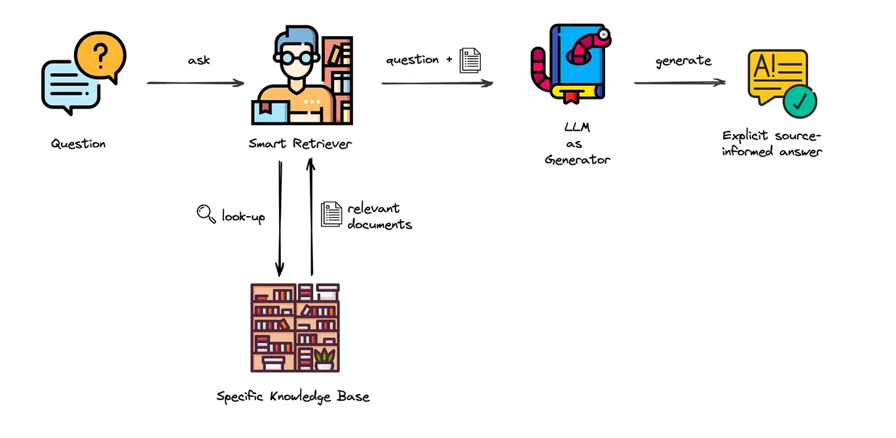

[](https://pyscaffold.org/)
[](https://ragskeleton.readthedocs.io/en/latest/)
[](https://github.com/hasan-sayeed/RAGSkeleton/issues)
[](https://github.com/hasan-sayeed/RAGSkeleton/discussions)
[](https://github.com/hasan-sayeed/RAGSkeleton/commits/main/)
<!-- These are examples of badges you might also want to add to your README. Update the URLs accordingly.
[](https://cirrus-ci.com/github/<USER>/rag_skeleton)
[](https://rag_skeleton.readthedocs.io/en/stable/)
[](https://coveralls.io/r/<USER>/rag_skeleton)
[](https://pypi.org/project/rag_skeleton/)
[](https://anaconda.org/conda-forge/rag_skeleton)
[](https://pepy.tech/project/rag_skeleton)
[](https://twitter.com/rag_skeleton)
-->

# RAGSkeleton



*Figure: Schematic of a Retrieval-Augmented Generation (RAG) system. Adapted from [Elevating Your Retrieval Game: Insights from Real-world Deployments](https://blog.ml6.eu/elevating-your-retrieval-game-insights-from-real-world-deployments-84ccfcbe6422).*

**RAGSkeleton**: A foundational, modular framework for building customizable Retrieval-Augmented Generation (RAG) systems across any domain.

This project was originally developed as a Retrieval-Augmented Generation (RAG) system for materials science literature. However, it can be easily adapted for any domain with minimal modifications, making it a flexible RAG skeleton architecture. Users can adjust the system prompt to tailor responses to any field, making this setup a versatile foundation for a RAG system.

With this skeleton, users can seamlessly swap out different components—such as the embedding model, vector database, or LLM for response generation—with their preferred options, and quickly build a RAG system suited to their data and needs. This architecture significantly reduces the time and effort required to create a custom RAG system.

## Installation

To set up the necessary environment:

1. **Create the Conda Environment**: Use the provided `environment.yml` file to create a new conda environment with all necessary dependencies:

   ```bash
   conda env create -f environment.yml
   ```

2. **Activate the Environment**: 
   
   ```bash
   conda activate rag_skeleton
   ```

NOTE: The conda environment will have RAGSkeleton installed in editable mode.
Some changes, e.g., in setup.cfg, might require you to run pip install -e . again.

3. **Optional Setup for Git Hooks:**

- Install pre-commit git hooks with:

   ```bash
   pre-commit install
   ```

- This configuration can be modified in .pre-commit-config.yaml.
- Install nbstripout to automatically remove notebook output cells in committed files:

   ```bash
   nbstripout --install --attributes notebooks/.gitattributes
   ```

## Setting Up the RAG System

### 1. Prepare Documents

Place your raw PDF files in the `data/raw` directory. Ensure the folder contains the files you want to process and query.

### 2. Process and Index Documents

To process and index your documents, navigate to the project root directory and open a Python interactive session by typing:

   ```bash
   python
   ```

Then, run the following code to load, process, and create the vector database:

   ```bash
   from src.rag_skeleton.data_processing import DataProcessor

   # Initialize and run data processing
   process_data = DataProcessor()
   process_data.process_and_create_db()
   ```

After running these commands, exit the Python session by typing:

   ```bash
   exit()
   ```

This step will:

- Load the PDF files.
- Parse and split them into chunks of text.
- Create an indexable vector database for efficient document retrieval.

**Default Components:**

- The default vector store used is **Chroma**, an open-source vector database optimized for speed and flexibility.
- The default embedding model is **"Alibaba-NLP/gte-large-en-v1.5"**, chosen for its smaller size and good Retrieval Average on the **Massive Text Embedding Benchmark (MTEB) Leaderboard** at the time of this project.
Note: The MTEB leaderboard is frequently updated with new and improved models. While `"Alibaba-NLP/gte-large-en-v1.5"` was a top choice during development, you may want to explore updated models on the [MTEB leaderboard] to identify the best current model for your specific needs.

## Running the RAG System

You can run the RAG system in two modes: **local** and **API**. The default mode is **local**.

### Option 1: Local Mode

In local mode, the model is loaded from your local machine. This option is suitable if you have the necessary computational resources.

**Run the Chatbot Locally**

Before running locally, ensure you have access to the Hugging Face model. You’ll need to log in to Hugging Face and download the model the first time you use it. Run the following command to log in to Hugging Face from your terminal:

   ```bash
   huggingface-cli login
   ```

This will prompt you for your Hugging Face access token. After logging in, you can proceed to load the model locally.

   ```bash
   python src/rag_skeleton/run.py --load_mode local --model_name "your_model_name"
   ```

- `--load_mode`: Set to `local` to load the model locally (default is `local`).
- `--model_name`: Specify the model name you want to use. The default is `"meta-llama/Llama-3.2-3B-Instruct"`.

**Example:**

   ```bash
   python src/rag_skeleton/run.py --load_mode local --model_name "meta-llama/Llama-3.2-3B-Instruct"
   ```

### Option 2: API Mode
In API mode, the model is accessed via the Hugging Face API. This is useful if you prefer not to host the model locally or lack the computational resources.

With the API, you can opt for larger models that might otherwise be challenging to run locally. However, keep in mind that the Hugging Face Free API has a model size limit of 10GB. If you need to use larger models, consider a paid API plan or explore model optimization techniques.

**Run the Chatbot via Hugging Face API**

   ```bash
   python src/rag_skeleton/run.py --load_mode api --model_name "your_model_name" --api_token YOUR_API_TOKEN
   ```

- `--load_mode`: Set to `api` to use the Hugging Face API.
- `--model_name`: Specify the model name available on Hugging Face Hub.
- `--api_token`: Your Hugging Face API token (required when using `api` mode).

**Example:**

   ```bash
   python src/rag_skeleton/run.py --load_mode api --model_name "meta-llama/Meta-Llama-3-8B-Instruct" --api_token YOUR_API_TOKEN
   ```

**Note:** You must have a Hugging Face account and an API token to use the API mode. You can obtain an API token by signing up at [Hugging Face] and navigating to your account settings.

## Usage
When you run the RAG system, you'll be greeted with:

   ```bash
   Welcome to the RAG chatbot. Type 'exit' to quit.
   ```

Type your questions into the chatbot interface. The system will provide answers grounded in the content of your documents.

The response will include sources for the context used in generating the answer, helping you trace the information back to the original documents. These sources will be listed at the end of the response, labeled with document titles or other metadata for easy reference.

**To exit**, simply type `exit`.

## Dependency Management & Reproducibility

1. Always keep your abstract (unpinned) dependencies updated in `environment.yml` and eventually
   in `setup.cfg` if you want to ship and install your package via `pip` later on.
2. Create concrete dependencies as `environment.lock.yml` for the exact reproduction of your
   environment with:
   ```bash
   conda env export -n rag_skeleton -f environment.lock.yml
   ```
   For multi-OS development, consider using `--no-builds` during the export.
3. Update your current environment with respect to a new `environment.lock.yml` using:
   ```bash
   conda env update -f environment.lock.yml --prune
   ```
## Project Organization

```
├── AUTHORS.md              <- List of developers and maintainers.
├── CHANGELOG.md            <- Changelog to keep track of new features and fixes.
├── CONTRIBUTING.md         <- Guidelines for contributing to this project.
├── Dockerfile              <- Build a docker container with `docker build .`.
├── LICENSE.txt             <- License as chosen on the command-line.
├── README.md               <- The top-level README for developers.
├── configs                 <- Directory for configurations of model & application.
├── data
│   ├── external            <- Data from third party sources.
│   ├── interim             <- Intermediate data that has been transformed.
│   ├── processed           <- The final, canonical data sets for modeling.
│   └── raw                 <- The original, immutable data dump.
├── docs                    <- Directory for Sphinx documentation in rst or md.
├── environment.yml         <- The conda environment file for reproducibility.
├── models                  <- Trained and serialized models, model predictions,
│                              or model summaries.
├── notebooks               <- Jupyter notebooks. Naming convention is a number (for
│                              ordering), the creator's initials and a description,
│                              e.g. `1.0-fw-initial-data-exploration`.
├── pyproject.toml          <- Build configuration. Don't change! Use `pip install -e .`
│                              to install for development or to build `tox -e build`.
├── references              <- Data dictionaries, manuals, and all other materials.
├── reports                 <- Generated analysis as HTML, PDF, LaTeX, etc.
│   └── figures             <- Generated plots and figures for reports.
├── scripts                 <- Analysis and production scripts which import the
│                              actual PYTHON_PKG, e.g. train_model.
├── setup.cfg               <- Declarative configuration of your project.
├── setup.py                <- [DEPRECATED] Use `python setup.py develop` to install for
│                              development or `python setup.py bdist_wheel` to build.
├── src
│   └── rag_skeleton        <- Actual Python package where the main functionality goes.
├── tests                   <- Unit tests which can be run with `pytest`.
├── .coveragerc             <- Configuration for coverage reports of unit tests.
├── .isort.cfg              <- Configuration for git hook that sorts imports.
└── .pre-commit-config.yaml <- Configuration of pre-commit git hooks.
```

## Feedback

Any questions, comments, or suggestions are welcome! This project is a flexible foundation for RAG-based applications, and we’re open to improvements that can make it even more useful across various domains.

<!-- pyscaffold-notes -->

## Note

This project has been set up using [PyScaffold] 4.6 and the [dsproject extension] 0.7.2.

[MTEB leaderboard]: https://huggingface.co/spaces/mteb/leaderboard
[Hugging Face]: https://huggingface.co/
[conda]: https://docs.conda.io/
[pre-commit]: https://pre-commit.com/
[Jupyter]: https://jupyter.org/
[nbstripout]: https://github.com/kynan/nbstripout
[Google style]: http://google.github.io/styleguide/pyguide.html#38-comments-and-docstrings
[PyScaffold]: https://pyscaffold.org/
[dsproject extension]: https://github.com/pyscaffold/pyscaffoldext-dsproject